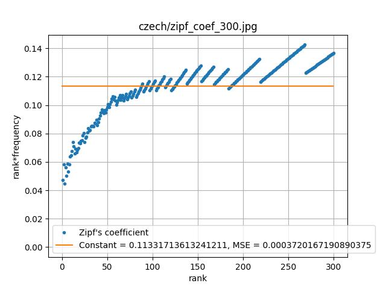

# Prównanie języka czeskiego do języka manuskryptu Wojnicza

## Prawo Zipfa
Gdy na podstawie ich korpusów językowych ustali się wykaz wyrazów ułożonych w malejącym porządku częstotliwości ich występowania, to ranga (numer porządkowy) wyrazu jest odwrotnie proporcjonalna do częstotliwości, zatem iloczyn częstotliwości i rangi powinien być wielkością stałą.

### Wyniki analizy dla najczęściej występujących 300 wyrazów

#### Częstotliwość występowania słów o kolejnych rangach - wykres powinien być hiperboliczny

Język czeski

Język z manuskryptu

#### Iloczyn częstotliwość występowania słów do ich rangi - wykres powinien być zbliżony do funkcji stałej

Język czeski

Język z manuskryptu

### Wniosek
Wykresy wskazują że dla słów o rangach 50-300, prawo Zipfa dla obu języków jest dobrze spełnione - odchylenia od stałej wartości są niewielkie. W przypadku języka z manuskryptu Wojnicza, z pominięciem kilku najczęściej występujących słów, są one zauważalnie mniejsze niż w analizowanym czeskim tekście. Wartości błędów średniokwadratowych dla dopasowanej przy użyciu np.polyfit stałej są zbliżone

## Analiza n-gramów
...
