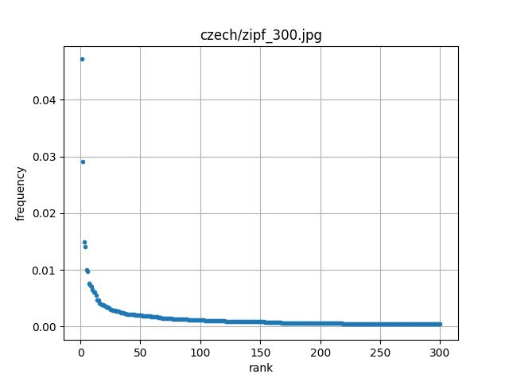
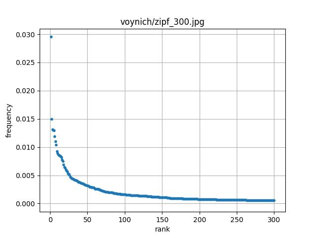

# Prównanie języka czeskiego do języka manuskryptu Wojnicza

## Prawo Zipfa
Gdy na podstawie ich korpusów językowych ustali się wykaz wyrazów ułożonych w malejącym porządku częstotliwości ich występowania, to ranga (numer porządkowy) wyrazu jest odwrotnie proporcjonalna do częstotliwości, zatem iloczyn częstotliwości i rangi powinien być wielkością stałą.

### Wyniki analizy dla najczęściej występujących 300 wyrazów

#### Częstotliwość występowania słów o kolejnych rangach - wykres powinien być hiperboliczny



Język czeski
<hr>



Język z manuskryptu

#### Iloczyn częstotliwość występowania słów do ich rangi - wykres powinien być zbliżony do funkcji stałej


Język czeski
<hr>


Język z manuskryptu

### Wniosek
Wykresy wskazują że dla słów o rangach 50-300, prawo Zipfa dla obu języków jest dobrze spełnione - odchylenia od stałej wartości są niewielkie. W przypadku języka z manuskryptu Wojnicza, z pominięciem kilku najczęściej występujących słów, są one zauważalnie mniejsze niż w analizowanym czeskim tekście. Wartości błędów średniokwadratowych dla dopasowanej przy użyciu np.polyfit stałej są zbliżone

## Analiza n-gramów
Analizę n-gramów zaczyna się od zliczania wystąpień sekwencji o ustalonej długości n w istniejących zasobach językowych. Zlicza się wszystkie pojedyncze wystąpienia (1-gramy, unigramy), dwójki (2-gramy, bigramy) i trójki (3-gramy, trigramy).
#### Dla języka czeskiego 10 najcześciej występujących bigramów wygląda następująco:
```
                   words  occurrences
              (jako, by)           29
               (a, jeho)           26
                (je, to)           24
                (by, se)           19
      (francesco, pazzi)           13
                  (a, v)           12
        (de, montesecco)           12
  (arcibiskup, salviati)           10
                (a, pak)           10
        (jeho, svatosti)           10
```
#### Dla Manuskryptu Wojnicza 10 najcześciej występujących bigramów wygląda następująco:
```
          words  occurrences
     (TOE, 8AM)           37
       (OR, AM)           32
  (SC8G, 4ODAM)           27
     (8AM, 8AM)           23
   (SCG, 4ODAM)           23
     (TOE, TOE)           22
    (4OE, TC8G)           22
  (TC8G, 4ODAM)           21
     (OE, SC8G)           21
     (8AM, TCG)           20
```
#### Język czeski 10 najcześciej występujących trigramów:
```
                         words  occurrences
                (jako, by, se)           10
               (s, maria, del)            7
           (maria, del, fiore)            7
      (okna, paláce, signorie)            4
               (jako, by, byl)            4
  (okna, florentské, signorie)            4
            (chrámu, s, maria)            4
                 (zdá, se, že)            4
   (v, člověčenství, kristovo)            4
            (můj, drahý, pier)            3
```
#### Manuskrypt Wojnicza 10 najcześciej występujących trigramów:
```
                     words  occurrences
        (OE, SC8G, 4ODC8G)            4
          (TCG, 4OE, TC8G)            4
            (8AM, 8G, 8AM)            3
  (4ODC8G, 4ODC8G, 4ODC8G)            3
        (SCG, 4ODAM, TC8G)            3
        (4OE, TC8G, 4ODAM)            3
        (SC8G, 4ODAM, SCG)            3
   (SC8G, 4ODC8G, 4ODCC8G)            3
     (SCC8G, 4ODC8G, TC8G)            3
        (OE, SC8G, 4ODCCG)            3
```
### Wniosek
W języku czeskim konretne bigramy występują niemal o połowę rzadziej, niż w tekście Manuksryptu Wojnicza. Natomiast trigramy są liczniejsze w języku czeskim. Może to świadczyć o kilku cechach języka używanego do pisania Manuskryptu Wojnicza:
- język ten może charakteryzować się prostszą strukturą słów, co oznacza, że słowa w tym języku mają tendencję do występowania w bardziej podstawowych formach, a zmiany formy są mniej rozbudowane
- w języku Manuskryptu Wojnicza dominują krótsze struktury zdaniowe, co oznacza, że może zawierać bogatszą frazeologię
- różnice w leksykonie i preferencje co do długości fraz czy zwrotów mogą wpływać także na stosunek między bigramami a trigramami, co obserwujemy w Manuskrypcie Wojnicza
## Grafy dwudzielne
#### 10 słów z największą liczbą krawędzi w grafie dwudzielnym w języku czeskim:
```
      count
a       472
se      284
na      136
v       127
jeho     95
je       92
to       80
s        75
ale      73
že       62
```
#### 10 słów z największą liczbą krawędzi w grafie dwudzielnym w Manuskrypcie Wojnicza:
```
       count
8AM      545
TC8G     272
AM       258
OE       237
4ODAM    227
TCG      225
SC8G     220
TOE      219
8AR      201
ODAM     191
```
### Wniosek
Słowa w języku czeskim mają na ogół mniej połączeń w grafie dwudzielnym. W Manuskrypcie Wojnicza słowa mają więcej połączeń, a także istnieje dużo słów z bardzo dużą liczbą połączeń. Ponadto liczba połączeń nie spada tak szybko jak w języku czeskim. Przyczyną tego może być na przykład zróżnicowanie struktury składniowej języka. Wiele różnych kombinacji słów może prowadzić do różnych, ale poprawnych składniowo, struktur zdaniowych. Kolejną przyczyną może być też fakt, że słowa w języku w którym pisany był Manuskrypt Wojnicza są wieloznaczne, to znaczy, że istnieje więcej możliwości, jak słowa mogą być połączone semantycznie.
